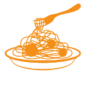
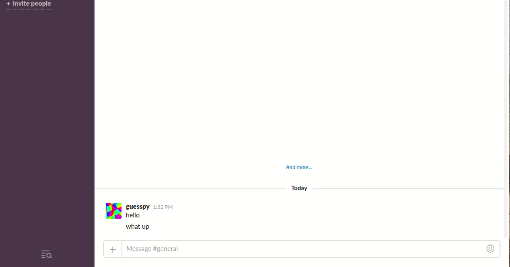

# Pasta

Pretty-paste source code on Slack



## /paste source code

**Pasta** is a Slack `/command` that allow you to past source code
directly on channels. The source code is converted into a file and its
[programming language is automatically detected](https://github.com/yoeo/guesslang).

#### Preview



## Install & Run

* Python 3.5+ required

* Create your Slack app and tokens https://api.slack.com/:

  - Find Client ID at `Basic Information > App Credentials > Client ID`

  - and Bot token at `OAuth & Permissions > OAuth Tokens & Redirect URLs > Tokens for Your Team > Bot User OAuth Access Token`

* Fill [config/tokens.json](config/tokens.json) with your Slack app tokens

* Install **Pasta** on your server:

```bash
pip3 install .
```

* Run **Pasta**:

```bash
pasta-gunicorn
```

* You can also provide the tokens as environment variables

```bash
PASTA_DEBUG=1 \
  PASTA_BOT_TOKEN="my-bot-user-token" \
  PASTA_CLIENT_ID="my-app-client-id" \
  pasta-gunicorn
```

## Create and run Pasta Docker container

* Create **Pasta** container

```bash
docker build -t pasta-img .
docker create -p 8000:8000 --name pasta \
  -e PASTA_BOT_TOKEN="my-bot-user-token" \
  -e PASTA_CLIENT_ID="my-app-client-id" \
  pasta-img
```

* Start **Pasta** container

```bash
docker start pasta
```

* Stop **Pasta** container

```bash
docker stop pasta
```

## License and stuff...

* [Language detection powered by Guesslang](https://github.com/yoeo/guesslang)

* [Guesslang documentation](https://guesslang.readthedocs.io/en/latest/)

* Icon created by
  [Demograph™ (Creative Commons)](https://thenounproject.com/term/spaghetti/187779/)

* Pasta — Copyright (c) 2020 Y. SOMDA, [MIT License](LICENSE)
